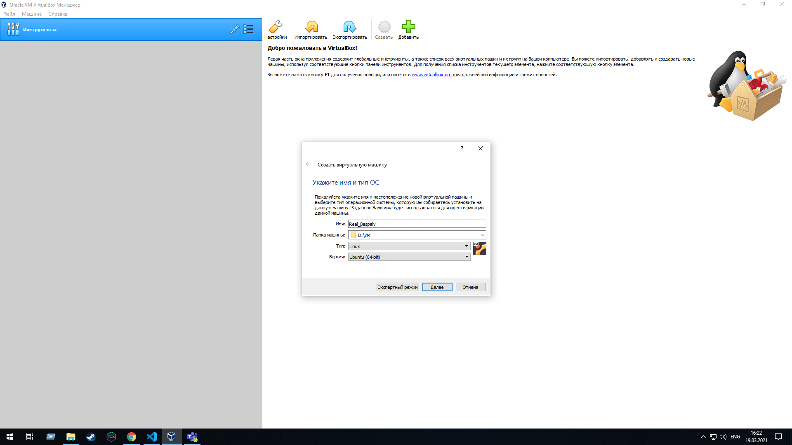

1.VMware, Oracle, Server Virtualization Solution (Hyper - V)
2.Differences of the most popular hypervisors:
1. Oracle VirtualBox is free, 
2. VMware have a lot of products. No free
3. Server Virtualization Solution (Hyper - V) free but requires a license from other products.

3.Looked atmanual VirtualBox
4.Download the latest stable version of VirtualBox-6.1.18-142142-Win 
5.Download ubuntu-20.04.2.0-desktop-amd64
<<<<<<< HEAD
6.
7.
8.
9.
10.
11.
12.
13.
14.
15.
16.
17.
18.
19.
20.
21.
22.
23.
=======
6.
7.
8.
9.
10.
11.
12.
13.
14.
15.
16.
17.
18.
19.
20.
21.
22.
>>>>>>> 41228cf04b8494da4f1941c40f283353abde003c
