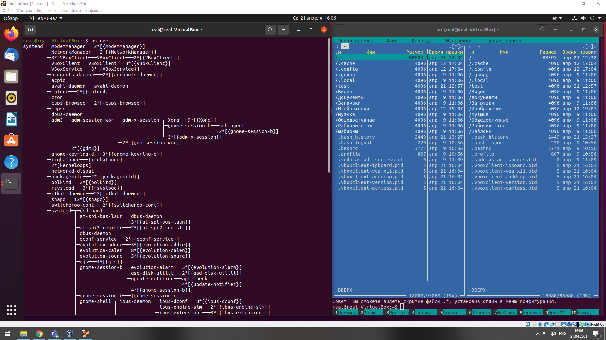
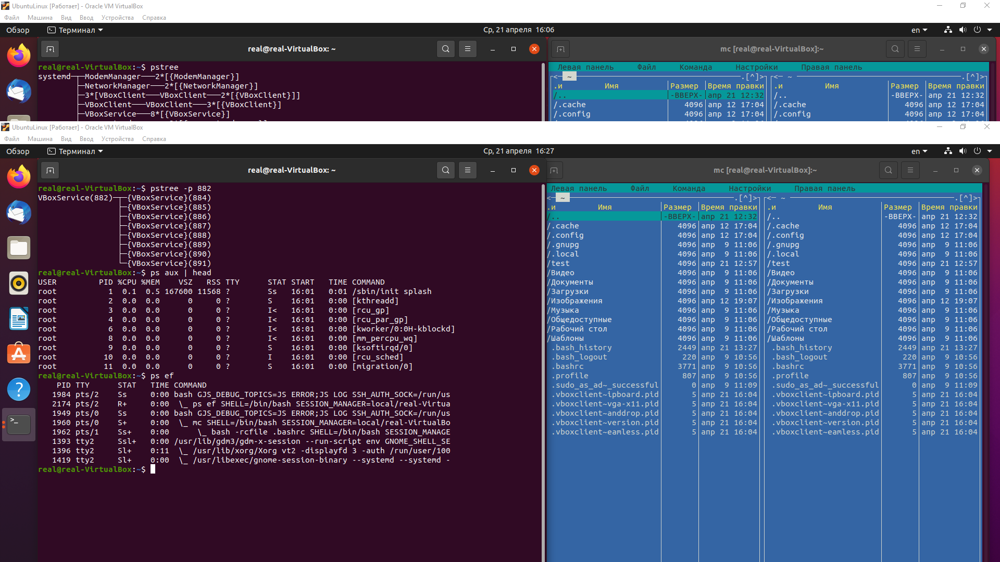
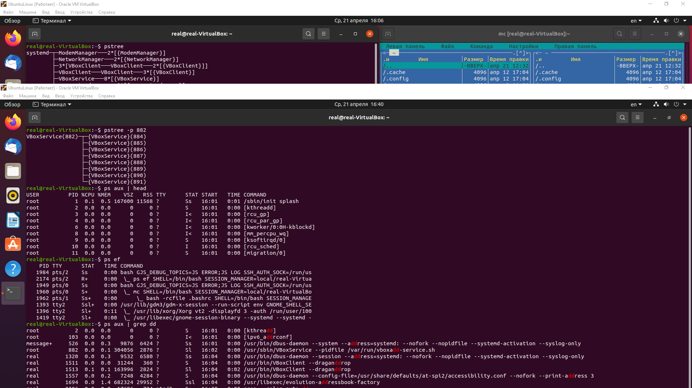
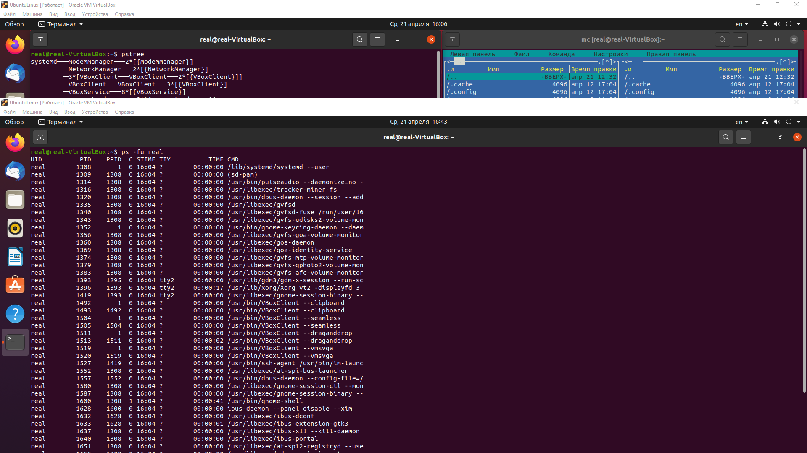
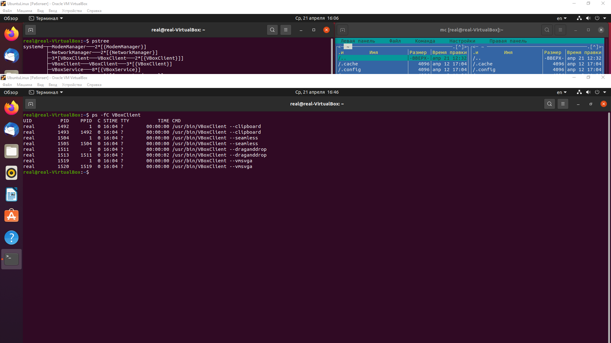
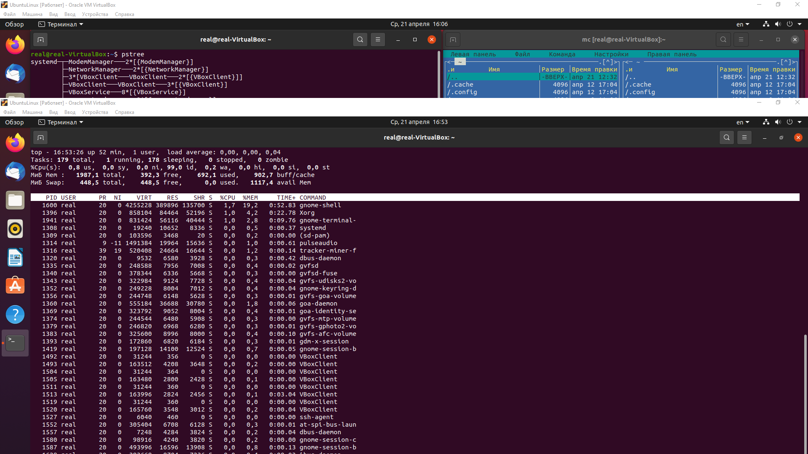
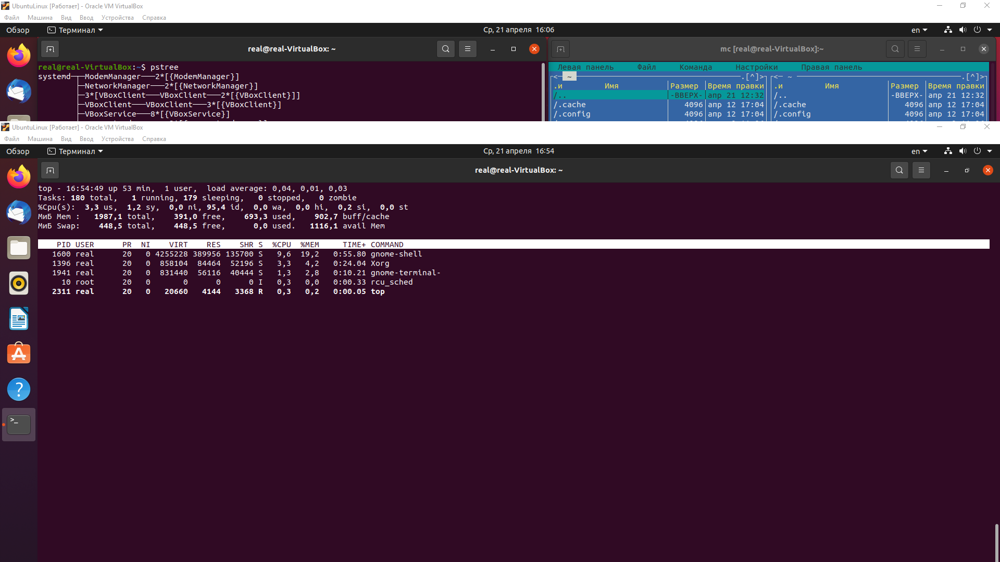
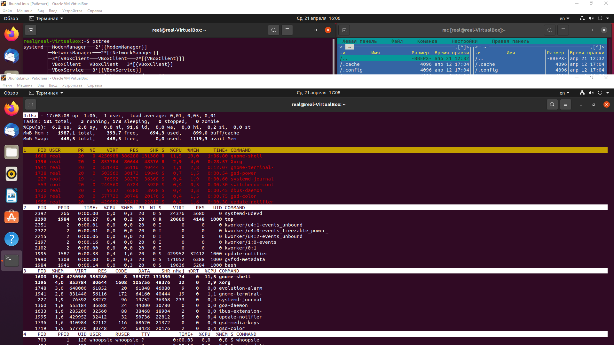
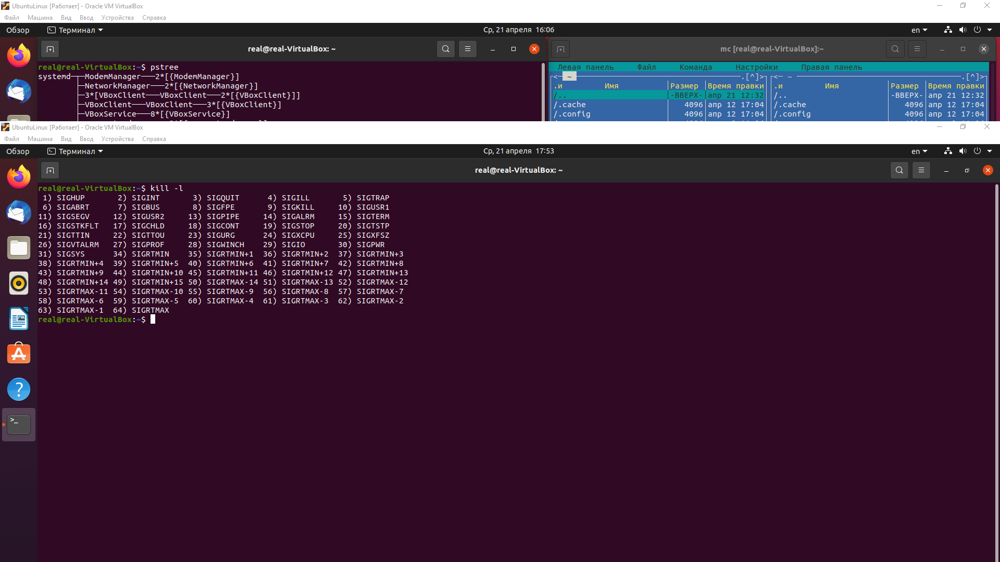
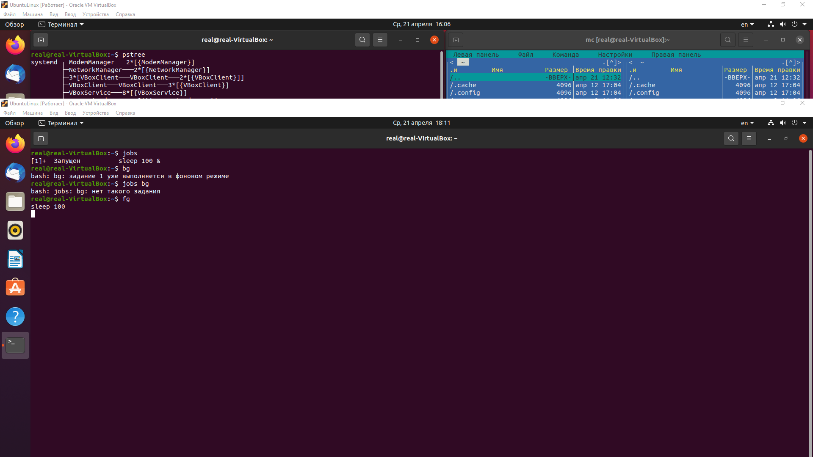

1.
2.

3.Файловая система proc содержит наиболее полную и подробную информацию о внутреннем устройстве и работе операционной системе Linux и позволяет точно настроить многие параметры своей работы.

4.
5.
6.

7.Утилита top позволяет выводить информацию о системе, а также список процессов динамически обновляя информацию о потребляемых ими ресурсах.

8.
9.
10.
11.

12.nice, renice

13.Можно использовать команду r с утилитой top, чтобы изменить приоритет текущего запущенного процесса.

14.

15.killall, pkill, kill -9.

16.jobs, fg, bg — управление фоновыми процессами

17.

18.Swap - это пространство подкачки это область на жестком диске, которая используется для временного хранения данных из оперативной памяти

19.